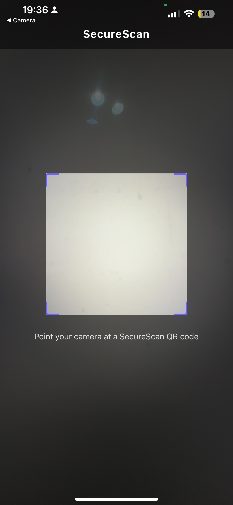
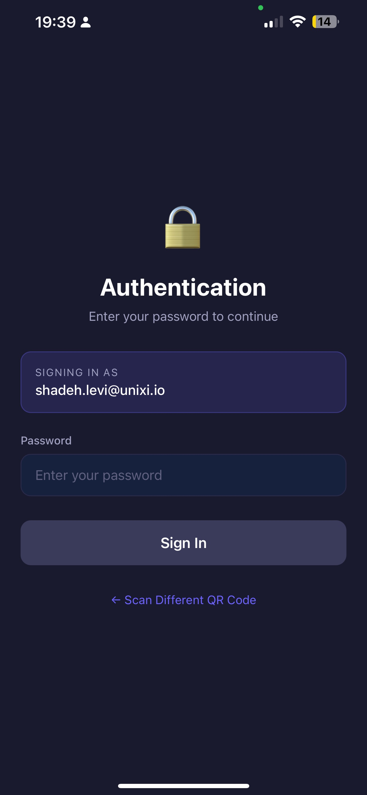
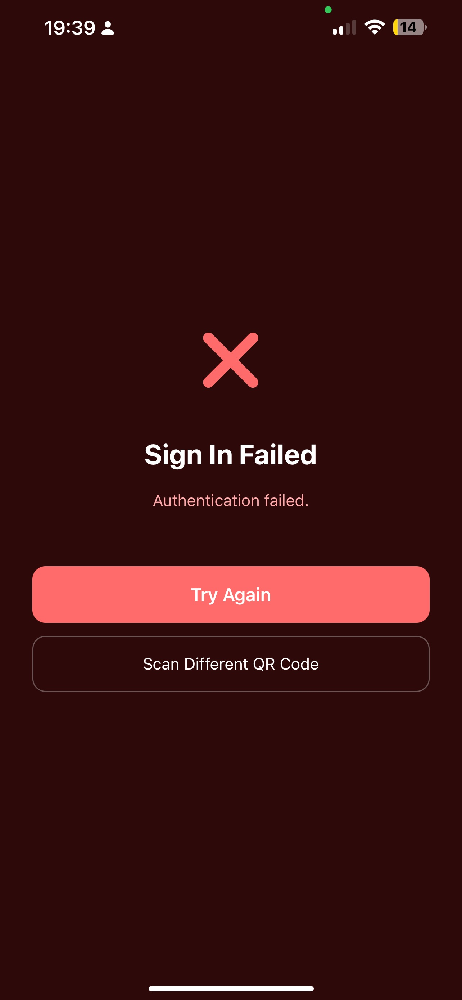
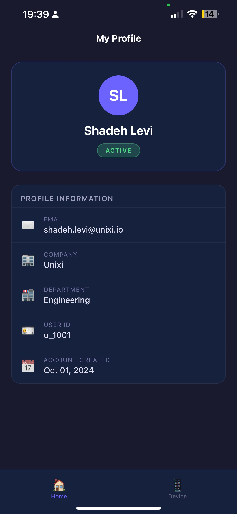
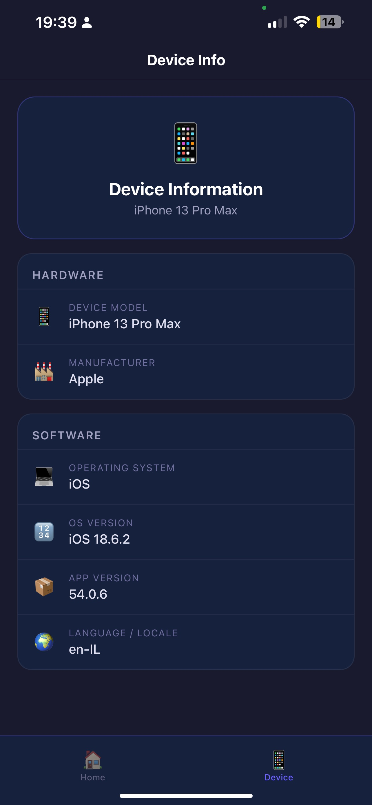

# SecureScan, React Native (Expo) Conversion

> **Note on development process:** I originally built this application in Android (Kotlin) as my primary submission for the Unixi Junior Mobile Developer assignment. This React Native version is a full conversion of that Android app, created with the assistance of **Claude Code** (Anthropic's AI coding tool). Claude Code translated the architecture, screens, API integration, and navigation from Kotlin/Android into React Native/JavaScript, while I guided the process, ran and tested the app on a real device, and debugged all issues that came up during development. I understand the full code and can explain every part of it.

---

SecureScan is a React Native application that demonstrates end to end mobile flow with:

- QR scanning (expo-camera)
- Dynamic backend configuration from QR payload
- Backend API integration (`/qr/resolve`, `/auth/validate`)
- Authentication success/failure handling
- Main app with two tabs:
  - Home (user profile data)
  - Device Information (device/app metadata)

---

## Features

### 1) QR Scan Flow
- App opens to QR scanner screen.
- Scans QR token/config and resolves backend/user data.
- Shows loading state while resolving.
- Handles camera permission and retry behavior.

### 2) Authentication Flow
- Displays resolved user email.
- User enters password and submits to backend (`POST /auth/validate`).
- On failure: navigates to Error screen with retry/scan-again actions.
- On success: navigates to Success screen, then auto-redirects to Main app.

### 3) Main Application
Bottom navigation with two tabs:
- **Home:** Full Name, Email, Company, Department, User ID, Account Creation Date.
- **Device Info:** Device Model, OS, OS Version, App Version, Manufacturer, Language/Locale.

### 4) Security/Networking Notes
- Password is not logged in request/response bodies.
- All communication uses HTTPS by default.
- Local dev HTTP is supported for testing against a local backend server.

---

## Tech Stack

| | |
|---|---|
| **Language** | JavaScript |
| **Framework** | React Native (Expo SDK 54) |
| **Architecture** | React Context + hooks (equivalent to MVVM) |
| **Networking** | Built-in `fetch` API |
| **QR / Camera** | expo-camera |
| **Navigation** | React Navigation v7 (Stack + Bottom Tabs) |
| **Device Info** | expo-device, expo-application, expo-localization |

---

## Backend API Used

- `POST /qr/resolve`
- `POST /auth/validate`
- `GET /demo/qr-tokens`
- `GET /health`

---

## Project Structure (high level)

```
src/screens/       — QrScan, Auth, Error, Success, Home, DeviceInfo
src/navigation/    — AppNavigator (stack + tabs setup)
src/context/       — AppContext (shared state across screens)
src/api/           — apiService (backend API calls)
src/utils/         — qrParser, dateFormatter
```

---

## How to Run

### 1. Prerequisites

- Node.js v18 or later
- Running backend server (Docker or local)
- Phone and computer on the **same Wi-Fi network**

**Expo Go** — install this app on your physical device before running:
- Android: [Google Play Store → search "Expo Go"](https://play.google.com/store/apps/details?id=host.exp.exponent)
- iOS: App Store → search "Expo Go"
---

### 2. Install dependencies

```bash
cd SecureScanRN
npm install --legacy-peer-deps
```

---

### 3. Start backend

Run the provided backend server from the assignment instructions.

---

### 4. Configure QR

Generate demo QR with values from:
- `GET /demo/qr-tokens`
Make sure QR content matches the app’s expected format for backend URL/token.
---

### 5. Run app

```bash
npm start
```

- **Physical device:** Open Expo Go → scan the QR code shown in the terminal
- **Android emulator:** Press `a`
- **iOS simulator:** Press `i`

Scan your SecureScan QR code and complete the auth flow.

---

## Test Scenarios

| Scenario | Expected Result |
|---|---|
| Valid QR → | Auth screen appears with user email |
| Wrong password → | Error screen |
| Correct password → | Success screen → Main app |
| Home tab | Shows resolved user info |
| Device Info tab | Shows local device/app info |
| Camera permission denied | Permission request flow works |
| Network failure | Shows unified error message |

---

## Screenshots

### QR Scan Screen
<p align="center">
  
</p>

### Authentication Screen
<p align="center">
  
</p>

### Error Screen
<p align="center">
  
</p>

### Success Screen
<p align="center">
  
</p>

### Main Screen — Home Tab
<p align="center">
  
</p>

### Main Screen — Device Info Tab
<p align="center">
  
</p>
